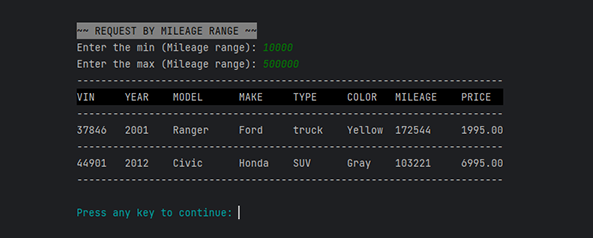

# Car Dealership Management System 🏢

This is a Car Dealership Management System that allows users to manage a vehicle inventory for a dealership. It provides functionalities to add vehicles, remove vehicles, and perform various searches based on different criteria such as price, make, model, year, color, mileage, and vehicle type.
## Getting Started 🚀

To run this application, you'll need to have Java installed on your computer. You can download the latest version of Java [here](https://www.java.com/en/download/).

Once you have Java installed, open the IntellJ IDE. Then navigate to the main.java file and press run.

## Interesting Code &nbsp;

    public void saveDealership(Dealership dealership) {
        FileWriter fileWriter = null;

        try {
            fileWriter = new FileWriter("inventory.csv", false); // Overwrite the existing file
            fileWriter.write(String.format("%s|%s|%s\n",dealershipDetails[0],dealershipDetails[1],dealershipDetails[2]));
            for (Vehicle vehicle : dealership.getAllVehicle()) {
                String s = String.format("%d|%d|%s|%s|%s|%s|%d|%.2f\n", vehicle.getVin(), vehicle.getYear(),
                        vehicle.getMake(), vehicle.getModel() ,vehicle.getVehicleType(), vehicle.getColor(),
                        vehicle.getOdometer(), vehicle.getPrice());
                fileWriter.write(s);
            }
        } catch (IOException e) {
            System.out.println(ColorCodes.RED+"Error occurred while writing to the file!"+ColorCodes.RESET);
        } finally {
            if (fileWriter != null) {
                try {
                    fileWriter.flush();
                    fileWriter.close();
                } catch (IOException e) {
                    System.out.println(ColorCodes.RED+"Error occurred while closing the file!"+ColorCodes.RESET);
                }
            }
        }

    }

This code snippet is interesting because it demonstrates file handling operations in Java. It uses a `FileWriter` to write dealership data to a file (`inventory.csv`). The code ensures that the existing file is overwritten to update the data accurately. It also utilizes string formatting to construct the data that is written to the file in a readable and consistent format. Exception handling is implemented to handle any potential errors that may occur during file operations, providing informative error messages. All in all, the code snippet showcases important concepts such as file handling, data persistence, string formatting, and exception handling.

## CLI Screenshots 📷
### Home Screen UI

### List All Vehicles

### Add Vehicle

### Remove Vehicle

### Find Vehicle by Price

### Find Vehicle by Year

#### Find Vehicle by Mileage

#### Find Vehicle by Color

#### Find Vehicle by Type

### Find Vehicle by Make-Model

### Manage Contract Screen

### Lease Vehicle

### Sale Vehicle

### Exit the application

## How to use📋

Once the application is running, you can interact with the Dealership Management System through the command-line interface. The available commands are:

- `1`: Manage Dealership.
- `2`: Manage Lease/Sale Contracts.
- `3`: Exit.

Simply enter the corresponding command number and follow the prompts to perform the desired action.

## Code Structure 📁
The code is organized into several classes:

- `Main`: Contains the main method to start the application.
- `Dealership`: Represents a dealership and provides methods to manage the vehicle inventory.
- `Vehicle`: Represents a vehicle with its properties and getters.
- `DealershipFileManager`: Handles file operations to load and save dealership data.
- `DealershipUI`: Handles user input and displays the dealership management command-line interface.
- `MainMenuUI`: Handles user input and displays the main menu command-line interface.
- `ContractUI`: Handles user input and displays the contract management command-line interface.
- `ContractFileManager`: Handles file operations to load and save contract data.

## Class Relationship Diagram
The class relationship diagram illustrates the relationships of the Contract class with other classes in the application. It provides an overview of how the Contract class interacts with and depends on other classes for functionality.

- The `Contract` class represents a general contract and serves as the base class for LeaseContract and SaleContract.
- The `LeaseContract` class extends the Contract class and adds specific properties such as expectedEnding and leaseFee for lease contracts.
- The `SaleContract` class extends the Contract class and includes additional properties like recordingFee, isFinance, and salesTax for sale contracts.